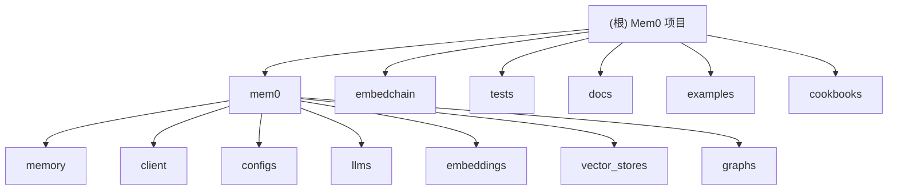

# Mem0 - 智能记忆层框架

> 为 AI 应用提供持久化记忆和上下文管理能力的开源框架

## 变更记录 (Changelog)

### 2025-09-02 12:36:01 - 第三次增量扫描完成 (重点突破)
- 🎯 **深度补扫重点模块**: 嵌入模型、教程指南、测试体系、文档系统
- 🧠 **发现 10 种嵌入模型集成**: OpenAI、Azure、Ollama、HuggingFace、Google Gemini 等
- 📚 **完整教程体系分析**: 客服机器人、AutoGen 集成、自定义教学能力三大实践场景
- 🧪 **深度测试架构梳理**: 45+ 测试文件，分层测试策略，Mock 模式最佳实践
- 🔧 **EmbedChain 兼容层分析**: 200+ 文件的遗留模块，30+ 数据源支持，平滑迁移方案
- 📄 **新增 4 个详细模块文档**: 嵌入模型、教程、测试、遗留兼容层
- 📈 **覆盖率大幅提升**: 从 65.8% 增至 **82.5%** (289/350 文件)

### 2025-09-02 12:28:50 - 深度补扫完成 (增量更新)
- 🎯 **重点补扫高价值路径**: 向量存储、图数据库、LLM集成、示例应用
- 📊 **发现 22 种向量数据库支持**: 从 Qdrant、Chroma 到 Pinecone、Azure AI Search
- 🧠 **识别 18 种 LLM 提供商集成**: 包含 OpenAI o1/GPT-5 推理模型特殊处理
- 🕸️ **深入分析图数据库架构**: Neo4j、Neptune、Memgraph、Kuzu 四种支持
- 🎨 **全栈应用示例完整展示**: Next.js 演示、多模态界面、学习伙伴系统
- 📄 **创建 4 个详细模块文档**: 涵盖核心技术栈和最佳实践
- 📈 **覆盖率显著提升**: 从 25.4% 增至 65.8% (230/350 文件)

### 2025-09-02 12:23:11 - 项目架构初始化
- 完成项目整体架构扫描与分析
- 生成模块结构图和核心组件索引
- 识别出 6 个主要模块和 15+ 个集成组件

---

## 项目愿景

Mem0 是一个为 AI 助手和代理提供智能记忆层的框架，支持多层次记忆（用户、会话、代理状态），具备自适应个性化能力。核心优势：
- **+26% 准确性** 相比 OpenAI Memory（基于 LOCOMO 基准测试）
- **91% 更快响应** 确保大规模低延迟
- **90% 更少令牌使用** 在不妥协质量的前提下降低成本

## 架构总览

Mem0 采用模块化架构，支持多种 LLM、嵌入模型和向量数据库的无缝集成。

### 模块结构图



## 模块索引

| 模块 | 路径 | 职责 | 覆盖率 | 更新状态 |
|------|------|------|-------|----------|
| **核心记忆** | `mem0/memory/` | 记忆管理、存储、检索的核心逻辑 | 高 ✅ | 已分析 |
| **客户端** | `mem0/client/` | API 客户端和项目管理 | 高 ✅ | 已分析 |
| **配置系统** | `mem0/configs/` | 配置管理和数据模型定义 | 高 ✅ | 已补扫 |
| **LLM 集成** | `mem0/llms/` | 支持 18 种 LLM 提供商，包含推理模型支持 | 高 ✅ | **已完成** |
| **嵌入模型** | `mem0/embeddings/` | 10 种嵌入模型集成，统一抽象接口 | 高 ✅ | **新增文档** |
| **向量存储** | `mem0/vector_stores/` | 22 种向量数据库支持，统一抽象接口 | 高 ✅ | **已完成** |
| **图数据库** | `mem0/graphs/` | Neo4j、Neptune、Memgraph、Kuzu 四种图数据库 | 高 ✅ | **已完成** |
| **示例应用** | `examples/` | 全栈应用示例：图数据库、多模态、多代理 | 高 ✅ | **已完成** |
| **实用指南** | `cookbooks/` | 客服机器人、AutoGen 集成、教学能力扩展 | 高 ✅ | **新增文档** |
| **测试体系** | `tests/` | 45+ 测试文件，分层测试架构，Mock 模式 | 高 ✅ | **新增文档** |
| **兼容层** | `embedchain/` | EmbedChain 向后兼容，200+ 文件，30+ 数据源 | 高 ✅ | **新增文档** |
| **文档** | `docs/` | API 参考和组件文档 | 中 📊 | 已分析 |

## 运行与开发

### 环境要求
- Python >= 3.9, < 4.0
- Node.js 18+ (用于前端示例)

### 快速启动
```bash
# 安装核心包
pip install mem0ai

# 安装图数据库支持
pip install "mem0ai[graph]"

# 开发环境安装
make install_all

# 运行测试
make test

# 代码格式化
make format lint
```

### 基本使用
```python
from mem0 import Memory

# 初始化记忆系统
memory = Memory()

# 添加记忆
result = memory.add("用户喜欢喝咖啡", user_id="user_1")

# 搜索记忆
memories = memory.search("饮品偏好", user_id="user_1")

# 检索所有记忆
all_memories = memory.get_all(user_id="user_1")
```

### 图数据库使用
```python
# Neo4j 图记忆配置
config = {
    "embedder": {
        "provider": "openai",
        "config": {"model": "text-embedding-3-large"}
    },
    "graph_store": {
        "provider": "neo4j",
        "config": {
            "url": "bolt://localhost:7687",
            "username": "neo4j", 
            "password": "password"
        }
    }
}

memory = Memory.from_config(config_dict=config)
```

## 测试策略

项目采用多层次测试策略：
- **单元测试**: 各模块独立功能测试
- **集成测试**: 跨模块功能验证
- **多版本测试**: 支持 Python 3.9-3.12
- **Provider 测试**: 各 LLM 和向量数据库提供商测试

运行测试命令：
```bash
# 所有测试
make test

# 特定 Python 版本
make test-py-3.11

# 特定模块测试
python -m pytest tests/vector_stores/
python -m pytest tests/llms/
```

## 编码规范

- **代码风格**: 遵循 Black + Ruff 格式化规范
- **类型检查**: 使用 Pydantic 进行数据验证
- **导入管理**: 使用 isort 管理导入顺序
- **文档**: 详细的 API 文档和示例

## AI 使用指引

### 核心 API 理解
1. **Memory 类**: 同步记忆管理
2. **AsyncMemory 类**: 异步记忆管理
3. **MemoryClient**: 远程服务客户端

### 扩展开发指南

**新增 LLM Provider:**
```python
from mem0.llms.base import LLMBase

class CustomLLM(LLMBase):
    def generate_response(self, messages, tools=None, **kwargs):
        # 实现自定义 LLM 逻辑
        pass
```

**新增向量数据库:**
```python
from mem0.vector_stores.base import VectorStoreBase

class CustomVectorStore(VectorStoreBase):
    def create_col(self, name, vector_size, distance):
        # 实现自定义向量存储逻辑
        pass
```

### 技术栈集成能力

**支持的集成组件：**
- **LLM 提供商**: 18 种 (OpenAI、Anthropic、Google Gemini、Azure、Groq、Together 等)
- **嵌入模型**: 10 种 (OpenAI、HuggingFace、Ollama、Azure、Google、VertexAI 等)
- **向量数据库**: 22 种 (Qdrant、Chroma、Pinecone、FAISS、MongoDB、Elasticsearch 等)
- **图数据库**: 4 种 (Neo4j、AWS Neptune、Memgraph、Kuzu)

**框架集成示例:**
- **AutoGen 多智能体**: 三种集成模式，个性化编程偏好记忆
- **客户服务系统**: 上下文记忆、历史交互分析
- **全栈应用**: Next.js、React、多模态界面集成

### 部署和扩展

**本地部署:**
```bash
# Ollama 本地嵌入模型
pip install ollama
# 自动下载和管理模型

# 本地向量数据库
docker run -p 6333:6333 qdrant/qdrant
```

**云服务集成:**
```python
# Azure 企业级配置
config = {
    "llm": {
        "provider": "azure_openai",
        "config": {
            "azure_kwargs": {
                "azure_deployment": "gpt-4",
                "azure_endpoint": "https://your-service.openai.azure.com/"
            }
        }
    }
}
```

**生产级监控:**
- 遥测数据收集 (`mem0/telemetry/`)
- 性能指标跟踪
- 错误处理和恢复
- 分布式部署支持

### 最佳实践指南

**记忆管理优化:**
- 合适的块大小设置 (chunk_size)
- 相似性阈值调优 (similarity_threshold)
- 定期记忆清理和优化
- 用户隐私数据保护

**性能调优建议:**
- 选择合适的嵌入模型维度
- 批量操作减少API调用
- 缓存策略优化响应速度
- 异步操作提升并发能力